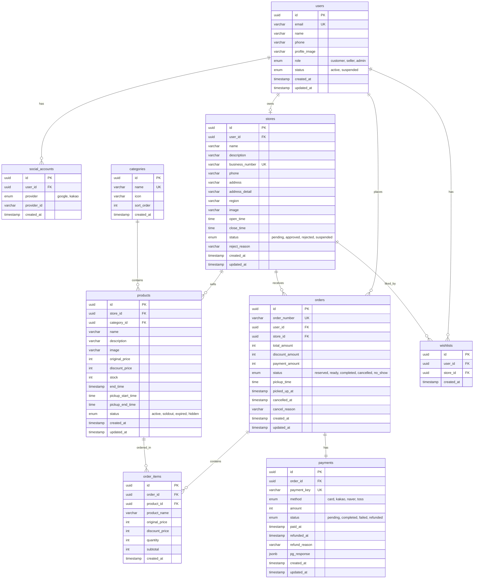

# 1. 테이블 목록

| 테이블명          | 설명             | 비고                        |
| ----------------- | ---------------- | --------------------------- |
| `users`           | 사용자           | 소비자, 판매자, 관리자 통합 |
| `social_accounts` | 소셜 로그인 계정 | Google, Kakao               |
| `stores`          | 가게             | 판매자 1:1                  |
| `categories`      | 카테고리         | 상품 분류                   |
| `products`        | 상품             | 마감 상품                   |
| `orders`          | 주문             | 예약 정보                   |
| `order_items`     | 주문 상품        | 주문-상품 연결              |
| `payments`        | 결제             | PG 결제 정보                |
| `wishlists`       | 찜               | 관심 가게                   |

---

# 2. 테이블 상세 정의

## 2.1 users (사용자)

| 컬럼명          | 타입         | 제약조건                     | 설명                         |
| --------------- | ------------ | ---------------------------- | ---------------------------- |
| `id`            | uuid         | PK                           | 사용자 ID                    |
| `email`         | varchar(255) | UNIQUE, NOT NULL             | 이메일                       |
| `name`          | varchar(100) | NOT NULL                     | 이름                         |
| `phone`         | varchar(20)  |                              | 연락처                       |
| `profile_image` | varchar(500) |                              | 프로필 이미지 URL            |
| `role`          | enum         | NOT NULL, DEFAULT 'customer' | 역할 (customer/seller/admin) |
| `status`        | enum         | NOT NULL, DEFAULT 'active'   | 상태 (active/suspended)      |
| `created_at`    | timestamp    | NOT NULL, DEFAULT now()      | 생성일시                     |
| `updated_at`    | timestamp    | NOT NULL, DEFAULT now()      | 수정일시                     |

**역할(role) 설명:**

- `customer`: 일반 사용자 (기본값)
- `seller`: 판매자 (가게 승인 후 변경)
- `admin`: 관리자

---

## 2.2 social_accounts (소셜 로그인 계정)

| 컬럼명        | 타입         | 제약조건                | 설명                  |
| ------------- | ------------ | ----------------------- | --------------------- |
| `id`          | uuid         | PK                      | 소셜 계정 ID          |
| `user_id`     | uuid         | FK → users.id, NOT NULL | 사용자 ID             |
| `provider`    | enum         | NOT NULL                | 제공자 (google/kakao) |
| `provider_id` | varchar(255) | NOT NULL                | 제공자 측 사용자 ID   |
| `created_at`  | timestamp    | NOT NULL, DEFAULT now() | 생성일시              |

**UNIQUE 제약:** `(provider, provider_id)`

---

## 2.3 stores (가게)

| 컬럼명            | 타입         | 제약조건                        | 설명            |
| ----------------- | ------------ | ------------------------------- | --------------- |
| `id`              | uuid         | PK                              | 가게 ID         |
| `user_id`         | uuid         | FK → users.id, UNIQUE, NOT NULL | 소유자 ID (1:1) |
| `name`            | varchar(100) | NOT NULL                        | 가게명          |
| `description`     | text         |                                 | 가게 소개       |
| `business_number` | varchar(20)  | UNIQUE, NOT NULL                | 사업자등록번호  |
| `phone`           | varchar(20)  | NOT NULL                        | 가게 연락처     |
| `address`         | varchar(255) | NOT NULL                        | 주소            |
| `address_detail`  | varchar(255) |                                 | 상세 주소       |
| `region`          | varchar(50)  | NOT NULL                        | 지역 (필터용)   |
| `image`           | varchar(500) |                                 | 가게 이미지 URL |
| `open_time`       | time         |                                 | 영업 시작 시간  |
| `close_time`      | time         |                                 | 영업 종료 시간  |
| `status`          | enum         | NOT NULL, DEFAULT 'pending'     | 상태            |
| `reject_reason`   | varchar(500) |                                 | 거절 사유       |
| `created_at`      | timestamp    | NOT NULL, DEFAULT now()         | 생성일시        |
| `updated_at`      | timestamp    | NOT NULL, DEFAULT now()         | 수정일시        |

**상태(status) 설명:**

- `pending`: 승인 대기
- `approved`: 승인 완료
- `rejected`: 승인 거절
- `suspended`: 운영 정지

---

## 2.4 categories (카테고리)

| 컬럼명       | 타입        | 제약조건                | 설명                          |
| ------------ | ----------- | ----------------------- | ----------------------------- |
| `id`         | uuid        | PK                      | 카테고리 ID                   |
| `name`       | varchar(50) | UNIQUE, NOT NULL        | 카테고리명                    |
| `icon`       | varchar(50) |                         | 아이콘 (이모지 또는 아이콘명) |
| `sort_order` | int         | NOT NULL, DEFAULT 0     | 정렬 순서                     |
| `created_at` | timestamp   | NOT NULL, DEFAULT now() | 생성일시                      |

**기본 카테고리 예시:**

- 🥖 베이커리
- 🍱 도시락/반찬
- 🥗 샐러드
- ☕ 카페/디저트
- 🍚 분식

---

## 2.5 products (상품)

| 컬럼명              | 타입         | 제약조건                                      | 설명            |
| ------------------- | ------------ | --------------------------------------------- | --------------- |
| `id`                | uuid         | PK                                            | 상품 ID         |
| `store_id`          | uuid         | FK → [stores.id](http://stores.id/), NOT NULL | 가게 ID         |
| `category_id`       | uuid         | FK → [categories.id](http://categories.id/)   | 카테고리 ID     |
| `name`              | varchar(100) | NOT NULL                                      | 상품명          |
| `description`       | text         |                                               | 상품 설명       |
| `image`             | varchar(500) |                                               | 상품 이미지 URL |
| `original_price`    | int          | NOT NULL                                      | 원가            |
| `discount_price`    | int          | NOT NULL                                      | 할인가          |
| `stock`             | int          | NOT NULL, DEFAULT 0                           | 재고 수량       |
| `end_time`          | timestamp    | NOT NULL                                      | 마감 시간       |
| `pickup_start_time` | time         | NOT NULL                                      | 픽업 시작 시간  |
| `pickup_end_time`   | time         | NOT NULL                                      | 픽업 종료 시간  |
| `status`            | enum         | NOT NULL, DEFAULT 'active'                    | 상태            |
| `created_at`        | timestamp    | NOT NULL, DEFAULT now()                       | 생성일시        |
| `updated_at`        | timestamp    | NOT NULL, DEFAULT now()                       | 수정일시        |

**상태(status) 설명:**

- `active`: 판매중
- `soldout`: 품절
- `expired`: 마감됨
- `hidden`: 숨김

**할인율 계산:** `(original_price - discount_price) / original_price * 100`

---

## 2.6 orders (주문)

| 컬럼명            | 타입         | 제약조건                                      | 설명                     |
| ----------------- | ------------ | --------------------------------------------- | ------------------------ |
| `id`              | uuid         | PK                                            | 주문 ID                  |
| `order_number`    | varchar(20)  | UNIQUE, NOT NULL                              | 주문번호 (표시용)        |
| `user_id`         | uuid         | FK → [users.id](http://users.id/), NOT NULL   | 주문자 ID                |
| `store_id`        | uuid         | FK → [stores.id](http://stores.id/), NOT NULL | 가게 ID                  |
| `total_amount`    | int          | NOT NULL                                      | 총 상품 금액 (원가 기준) |
| `discount_amount` | int          | NOT NULL                                      | 총 할인 금액             |
| `payment_amount`  | int          | NOT NULL                                      | 실 결제 금액             |
| `status`          | enum         | NOT NULL, DEFAULT 'reserved'                  | 주문 상태                |
| `pickup_time`     | time         | NOT NULL                                      | 픽업 예정 시간           |
| `picked_up_at`    | timestamp    |                                               | 픽업 완료 시간           |
| `cancelled_at`    | timestamp    |                                               | 취소 시간                |
| `cancel_reason`   | varchar(500) |                                               | 취소 사유                |
| `created_at`      | timestamp    | NOT NULL, DEFAULT now()                       | 생성일시                 |
| `updated_at`      | timestamp    | NOT NULL, DEFAULT now()                       | 수정일시                 |

**주문번호 형식:** `PM` + `YYYYMMDD` + `XXXXXX` (예: PM20260420000001)

**상태(status) 설명:**

- `reserved`: 예약 완료 (결제 완료)
- `ready`: 픽업 대기 (픽업 시간 도래)
- `completed`: 픽업 완료
- `cancelled`: 취소됨
- `no_show`: 노쇼

---

## 2.7 order_items (주문 상품)

| 컬럼명           | 타입         | 제약조건                                          | 설명                             |
| ---------------- | ------------ | ------------------------------------------------- | -------------------------------- |
| `id`             | uuid         | PK                                                | 주문 상품 ID                     |
| `order_id`       | uuid         | FK → [orders.id](http://orders.id/), NOT NULL     | 주문 ID                          |
| `product_id`     | uuid         | FK → [products.id](http://products.id/), NOT NULL | 상품 ID                          |
| `product_name`   | varchar(100) | NOT NULL                                          | 상품명 (스냅샷)                  |
| `original_price` | int          | NOT NULL                                          | 원가 (스냅샷)                    |
| `discount_price` | int          | NOT NULL                                          | 할인가 (스냅샷)                  |
| `quantity`       | int          | NOT NULL                                          | 수량                             |
| `subtotal`       | int          | NOT NULL                                          | 소계 (discount_price × quantity) |
| `created_at`     | timestamp    | NOT NULL, DEFAULT now()                           | 생성일시                         |

> **스냅샷**: 주문 시점의 상품 정보를 저장하여 상품 정보 변경 시에도 주문 내역 유지

---

## 2.8 payments (결제)

| 컬럼명          | 타입         | 제약조건                                              | 설명             |
| --------------- | ------------ | ----------------------------------------------------- | ---------------- |
| `id`            | uuid         | PK                                                    | 결제 ID          |
| `order_id`      | uuid         | FK → [orders.id](http://orders.id/), UNIQUE, NOT NULL | 주문 ID (1:1)    |
| `payment_key`   | varchar(200) | UNIQUE                                                | PG사 결제 키     |
| `method`        | enum         | NOT NULL                                              | 결제 수단        |
| `amount`        | int          | NOT NULL                                              | 결제 금액        |
| `status`        | enum         | NOT NULL, DEFAULT 'pending'                           | 결제 상태        |
| `paid_at`       | timestamp    |                                                       | 결제 완료 시간   |
| `refunded_at`   | timestamp    |                                                       | 환불 완료 시간   |
| `refund_reason` | varchar(500) |                                                       | 환불 사유        |
| `pg_response`   | jsonb        |                                                       | PG사 응답 데이터 |
| `created_at`    | timestamp    | NOT NULL, DEFAULT now()                               | 생성일시         |
| `updated_at`    | timestamp    | NOT NULL, DEFAULT now()                               | 수정일시         |

**결제 수단(method):**

- `card`: 신용/체크카드
- `kakao`: 카카오페이
- `naver`: 네이버페이
- `toss`: 토스페이

**결제 상태(status):**

- `pending`: 결제 대기
- `completed`: 결제 완료
- `failed`: 결제 실패
- `refunded`: 환불 완료

---

## 2.9 wishlists (찜)

| 컬럼명       | 타입      | 제약조건                                      | 설명      |
| ------------ | --------- | --------------------------------------------- | --------- |
| `id`         | uuid      | PK                                            | 찜 ID     |
| `user_id`    | uuid      | FK → [users.id](http://users.id/), NOT NULL   | 사용자 ID |
| `store_id`   | uuid      | FK → [stores.id](http://stores.id/), NOT NULL | 가게 ID   |
| `created_at` | timestamp | NOT NULL, DEFAULT now()                       | 생성일시  |

**UNIQUE 제약:** `(user_id, store_id)`

---

# 3. 인덱스 설계

| 테이블      | 인덱스명                  | 컬럼             | 용도             |
| ----------- | ------------------------- | ---------------- | ---------------- |
| `users`     | `idx_users_email`         | email            | 로그인 조회      |
| `users`     | `idx_users_role`          | role             | 역할별 조회      |
| `stores`    | `idx_stores_status`       | status           | 상태별 조회      |
| `stores`    | `idx_stores_region`       | region           | 지역별 조회      |
| `products`  | `idx_products_store`      | store_id         | 가게별 상품 조회 |
| `products`  | `idx_products_category`   | category_id      | 카테고리별 조회  |
| `products`  | `idx_products_status_end` | status, end_time | 활성 상품 조회   |
| `orders`    | `idx_orders_user`         | user_id          | 사용자 주문 조회 |
| `orders`    | `idx_orders_store`        | store_id         | 가게 주문 조회   |
| `orders`    | `idx_orders_status`       | status           | 상태별 조회      |
| `wishlists` | `idx_wishlists_user`      | user_id          | 사용자 찜 조회   |

---

# 4. 관계 요약

```
users (1) ──── (N) social_accounts : 사용자는 여러 소셜 계정 연결 가능
users (1) ──── (1) stores : 판매자는 1개 가게만 소유 (MVP)
users (1) ──── (N) orders : 사용자는 여러 주문 가능
users (1) ──── (N) wishlists : 사용자는 여러 가게 찜 가능stores (1) ──── (N) products : 가게는 여러 상품 등록 가능
stores (1) ──── (N) orders : 가게는 여러 주문 수신 가능categories (1) ──── (N) products : 카테고리는 여러 상품 포함orders (1) ──── (N) order_items : 주문은 여러 상품 포함 가능
orders (1) ──── (1) payments : 주문당 1개 결제products (1) ──── (N) order_items : 상품은 여러 주문에 포함 가능
```

---

# 5. Supabase 특이사항

## 5.1 RLS (Row Level Security) 정책

| 테이블     | 정책                      | 설명                          |
| ---------- | ------------------------- | ----------------------------- |
| `users`    | 본인 데이터만 수정 가능   | `auth.uid() = id`             |
| `stores`   | 소유자만 수정 가능        | `auth.uid() = user_id`        |
| `products` | 가게 소유자만 수정 가능   | 가게 소유자 확인              |
| `orders`   | 주문자/가게 소유자만 조회 | 본인 주문 또는 본인 가게 주문 |

## 5.2 Supabase Auth 연동

- `users.id`는 Supabase Auth의 `auth.users.id`와 동일하게 사용
- 소셜 로그인 시 `social_accounts` 테이블에 provider 정보 저장
- Supabase Auth의 `user_metadata`에 추가 정보 저장 가능

---

# 6. 향후 확장 고려사항

| 기능        | 추가 테이블/컬럼                                |
| ----------- | ----------------------------------------------- |
| 1인 다점포  | `stores.user_id` UNIQUE 제약 제거               |
| 리뷰/평점   | `reviews` 테이블 추가                           |
| 포인트/쿠폰 | `points`, `coupons`, `user_coupons` 테이블 추가 |
| 채팅        | `chat_rooms`, `messages` 테이블 추가            |
| 알림        | `notifications` 테이블 추가                     |

---

# 7. ERD


