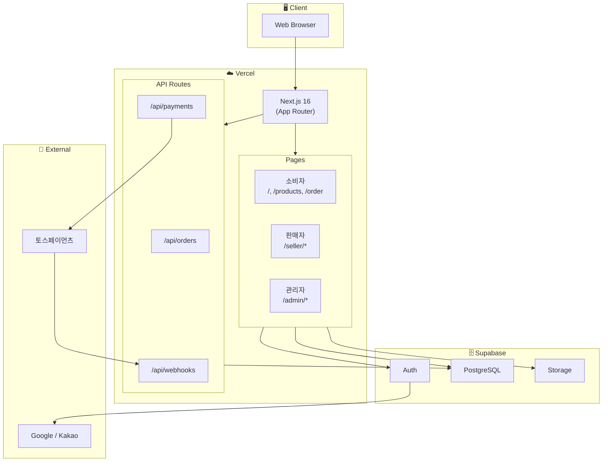
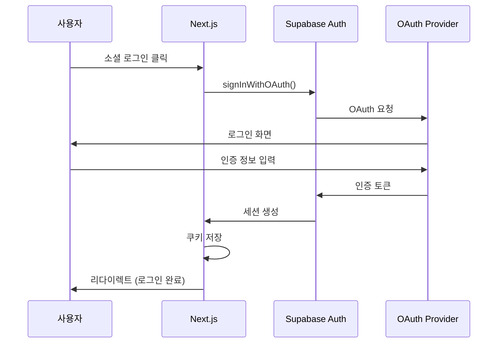
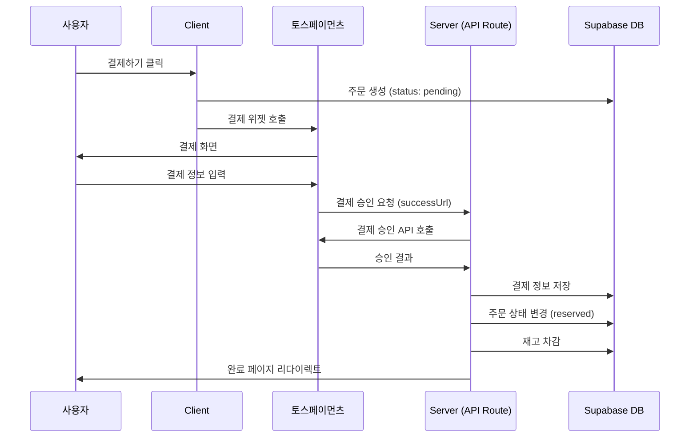
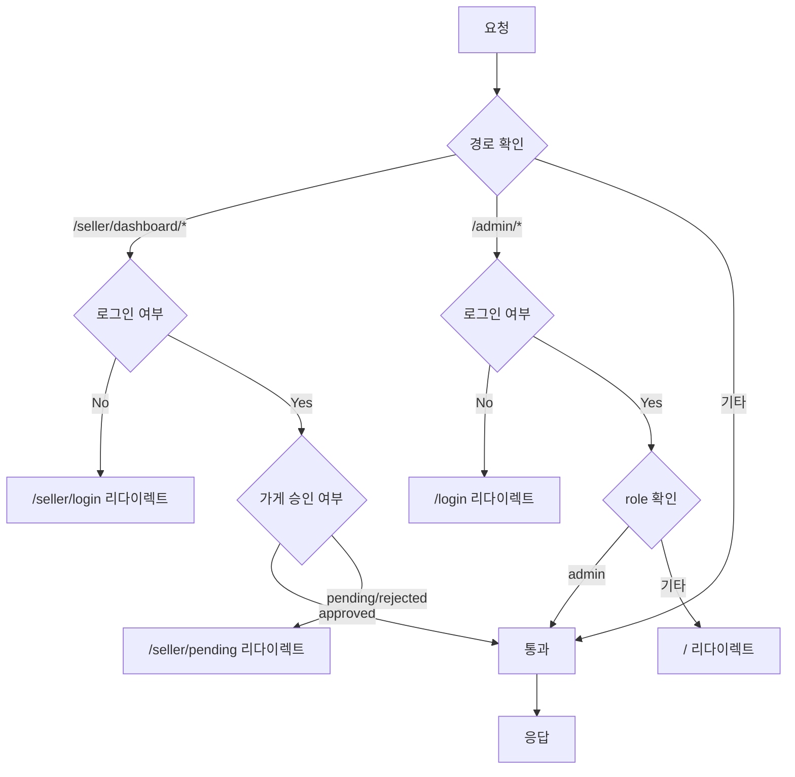
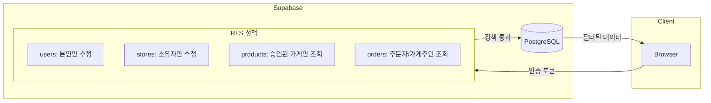
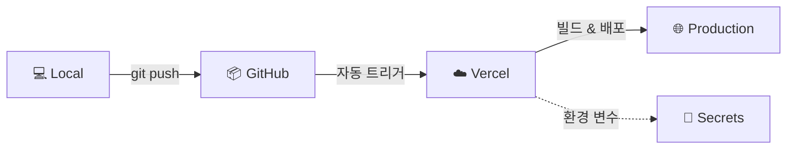

# 1. 기술 스택

| 계층           | 기술                       | 선정 이유                             |
| -------------- | -------------------------- | ------------------------------------- |
| **Frontend**   | Next.js 16 (App Router)    | SSR/SSG 지원, React 19, 과정 요구사항 |
| **Language**   | TypeScript                 | 타입 안정성, 개발 생산성              |
| **Styling**    | Tailwind CSS + Headless UI | 빠른 UI 개발, 일관된 디자인           |
| **State**      | Zustand                    | 가볍고 직관적인 상태 관리             |
| **BaaS**       | Supabase                   | Auth, DB, Storage 통합 제공           |
| **Database**   | PostgreSQL (Supabase)      | 관계형 DB, RLS 지원                   |
| **Payment**    | 토스페이먼츠               | 국내 PG, 문서화 우수                  |
| **Deployment** | Vercel                     | Next.js 최적화, 간편 배포             |

---

# 2. 아키텍처 특징

- **Serverless**: Vercel + Supabase 조합으로 서버 관리 불필요
- **BaaS 중심**: 백엔드 로직 최소화, Supabase 기능 최대 활용
- **API Routes**: 결제 등 민감한 로직은 서버 사이드에서 처리

---

# 3. 시스템 구성도



---

# 4. 인증 플로우



# 5. 결제 플로우



# 6. 미들웨어 권한 체크



# 7. 데이터 흐름 (RLS)



# 8. 배포 플로우



# 9. 폴더 구조

```
src/
├── app/                        # App Router
│   ├── (consumer)/             # 소비자 영역
│   ├── (seller)/seller/        # 판매자 영역
│   ├── (admin)/admin/          # 관리자 영역
│   ├── api/                    # API Routes
│   ├── layout.tsx
│   └── globals.css
│
├── components/                 # 컴포넌트
│   ├── common/
│   ├── consumer/
│   ├── seller/
│   └── admin/
│
├── lib/                        # 유틸리티
│   └── supabase/
│
├── stores/                     # Zustand 스토어
│
├── types/                      # TypeScript 타입
│
├── tests/                      # Vitest 테스트 파일
│
└── middleware.ts               # 미들웨어

```

# 10. Next.js 컨벤션 파일

| 파일명          | 설명             |
| --------------- | ---------------- |
| `page.tsx`      | 페이지 컴포넌트  |
| `layout.tsx`    | 레이아웃         |
| `route.ts`      | API Route 핸들러 |
| `middleware.ts` | 미들웨어 (루트)  |
| `loading.tsx`   | 로딩 UI (선택)   |
| `error.tsx`     | 에러 UI (선택)   |

# 11. 환경 변수

| 변수명                          | 용도               | 공개 여부 |
| ------------------------------- | ------------------ | --------- |
| `NEXT_PUBLIC_SUPABASE_URL`      | Supabase URL       | Public    |
| `NEXT_PUBLIC_SUPABASE_ANON_KEY` | Supabase 익명 키   | Public    |
| `SUPABASE_SERVICE_ROLE_KEY`     | Supabase 서비스 키 | Secret    |
| `NEXT_PUBLIC_TOSS_CLIENT_KEY`   | 토스 클라이언트 키 | Public    |
| `TOSS_SECRET_KEY`               | 토스 시크릿 키     | Secret    |
| `NEXT_PUBLIC_APP_URL`           | 앱 URL             | Public    |

# 12. 보안 고려사항

| 항목            | 대응 방안                              |
| --------------- | -------------------------------------- |
| **인증**        | Supabase Auth + 미들웨어 권한 체크     |
| **데이터 접근** | RLS 정책으로 행 단위 접근 제어         |
| **API 보안**    | 서버 사이드에서 민감한 로직 처리       |
| **결제 보안**   | PG사 위젯 사용, 서버에서 결제 승인     |
| **환경 변수**   | 민감 정보는 서버 전용 환경 변수로 관리 |

# 13. 심화 프로젝트 확장 포인트

| 기능                | 확장 방안                 |
| ------------------- | ------------------------- |
| **지도**            | Kakao Maps API 연동       |
| **실시간 알림**     | Supabase Realtime 구독    |
| **AI 추천**         | OpenAI API 연동           |
| **낙관적 업데이트** | TanStack Query 도입       |
| **E2E 테스트**      | Playwright 설정           |
| **CI/CD**           | GitHub Actions 워크플로우 |
